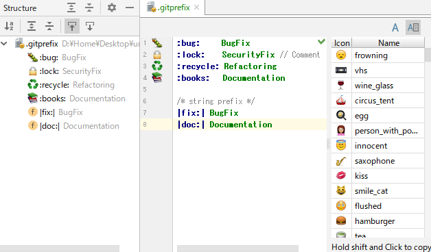
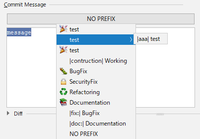

[:tada: buy me a coffee! (go to paypal page)](https://paypal.me/syuchan1005)

# GitPrefix
This can make 'Prefix Commit' easy.

[IntelliJ Plugin Page](https://plugins.jetbrains.com/plugin/9725-emojiprefix)

## Getting Started
1. Create GitPrefix File in your project root.
2. Write prefix's you want to use.
3. Commit!

> .gitprefix file location can change in [File->Settings->Tools->GitPrefix]

## .gitprefix sample
```
:bug:     BugFix
:lock:    SecurityFix // Comment
:recycle: Refactoring
:books:   Documentation

/* string prefix */
|fix:| BugFix
|doc:| Documentation

commit {
    :tada: test

    test {
        |aaa| test
    }
    ...test
}


merge {
    :art: test
    > test
}

tag {
    :+1: test
}

test {
    :tada: test
    |contruction| Working
}
```

## UI
||
|:--:|
||
||

